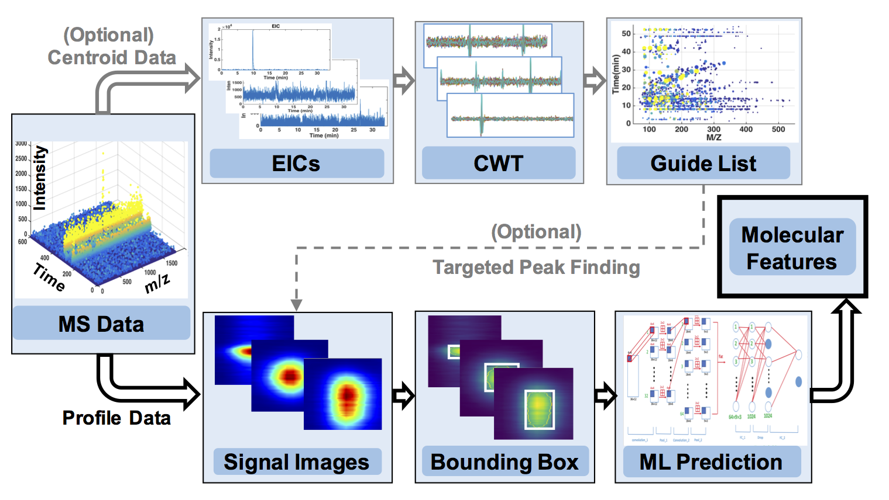

## Trace: Machine Learning of Signal Images for Trace-Sensitive Mass Spectrometry

## Introduction

This repository contains the Python code for the manuscript
> Liu, Z., et al. [ Trace: Machine Learning of Signal Images for Trace-Sensitive Mass Spectrometry – A Case Study from Single-Cell Metabolomics.](https://pubs.acs.org/doi/10.1021/acs.analchem.8b05985) *Anal. Chem*. 2019 91 (9), 5768-5776


Recent developments in high-resolution mass spectrometry (MS) technology enabled ultrasensitive detection of biomolecules even at the level of single cells. However, extraction of trace-abundance signals from complex MS datasets requires improved data and signal processing algorithms. To bridge this gap, we here developed *"Trace"*, a software package that incorporates machine learning (ML) to automate feature selection and optimization for the extraction of trace-level signals from MS data. The basic workflow is shown below:



## Setup

### Environment
*Trace* is implemented in Python with `TensorFlow`. For large MS data, we recommend 32+ GB RAM for fast data processing and sufficient data storage capacity. GPU is recommended (but not required) for speeding up the initial training of the model.

To run *Trace*, following software/libraries should be installed:

- [Anaconda](https://www.anaconda.com/)
- [TensorFlow](https://www.tensorflow.org/)
- [joblib==0.11](https://pypi.org/project/joblib/)

Other libraries may also be installed if not existent beforehand. For most of them, `pip install` would work. 

### Pre-trained models
To use *Trace* for signal detection on MS data, a pre-trained model is needed. You can download the pre_trained models here: 
 
 - [pre-trained_models [90M]](https://drive.google.com/file/d/1Fc6XwA3wLIaa-3n-syBOAu-tiB_vbQRT/view?usp=sharing) 

and put it under this directory.

While the pre-trained model is provided under default settings for our CE-ESI-MS data, users can also perform independent training for their customized datasets with the code provided. The details of training the model is discussed below.

### Input data format
*Trace* calls on both the centroid and profile MS data to reduce data processing time. Export and convert the MS1 spectra from each raw (primary) MS data file into the open-access `mzML` file format in both centroid and profile mode. 

High-resolution MS data from our study is available at the NIH Common Fund's Metabolomics Data Repository and Coordinating Center website, [the Metabolomics Workbench](http://www.metabolomicsworkbench.org) with Project ID PR000686. The data can be accessed directly via [Project DOI:10.21228/M80Q2W](http://www.metabolomicsworkbench.org/data/DRCCMetadata.php?Mode=Project&ProjectID=PR000686)

## Usage
### Signal Detection from MS Data 
To process your MS data for signal detection (with all parameters and inputs by default), make sure you already have the pre_trained models (either by downloading the models provided above or training you own model). Then simply run the main code by:

```
python TRACE.py
```
To change parameters and input MS files, edit the `TRACE.py` file as needed according to the code comments or our `User Manual`.

After running the code, a folder called "`Results`" will be generated (if not existent) and the result files will be saved under that folder. Three files will be generated:


| Output File &nbsp; &nbsp; &nbsp; &nbsp;  | Description |
| ---- | --- |
| `Initial_pks.txt` | Initial scanning signal list. Contains (m/z, retention time, intensity, peak area, SNR) for each signal. |
| `Images_pks.txt` | Images of the potential signals by initial scaning (60x12=720 pixels for each image per row by default). |
| `Final_pks.txt` | Final signal list. Contains (m/z, retention time, intensity, peak area, SNR) for each signal per row. |

### Train Your Own Model 
While the pre-trained model is provided by default with our CE-ESI-MS data, users are advised to perform independent training for customized datasets, particularly if different types of experimental conditions or technologies were used to acquire the data. For this purpose, besides the python code provided (`Training_Model.py`), users need to prepare their own training data: both positive (true) and negative (false) signal sample images (`imgs-train.txt`) and their labels (`label-train.txt`). The image file should be in such a format that each line stands for a flatted signal image (rows connect to a single row in order). The label file should be in one column indicating whether (1) or not (0) the signal image stands for a true signal in the image file of corresponding row. For example, if N (>1000 recommended for better model performance) samples are collected and labeled, then the data size should be (`N x 720`) for image file and (`N x 1 `)for label file. To run the program, execute the `Training_Model.py` code by 

```
python Training_Model.py
```  
For more details about *Trace*, please go to the paper.

## Contact us
If you have any questions or comments on *Trace*, please contact us: 

<chenz@gwu.edu>; <nemes@umd.edu>; <zhichaoliu@gwu.edu>.

